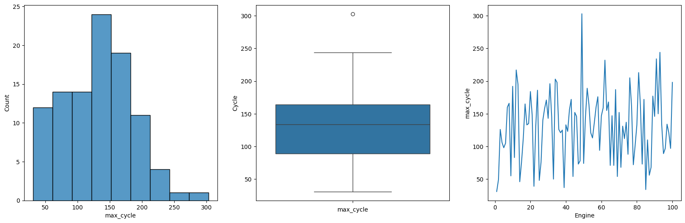
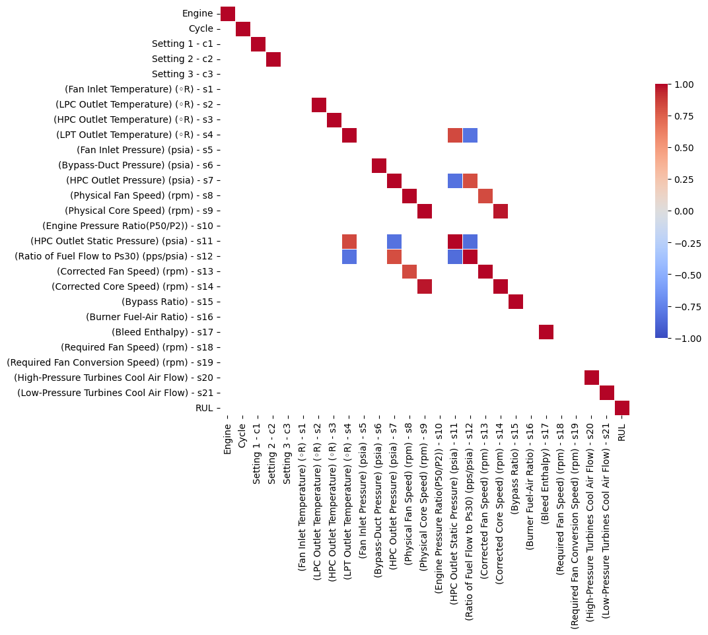
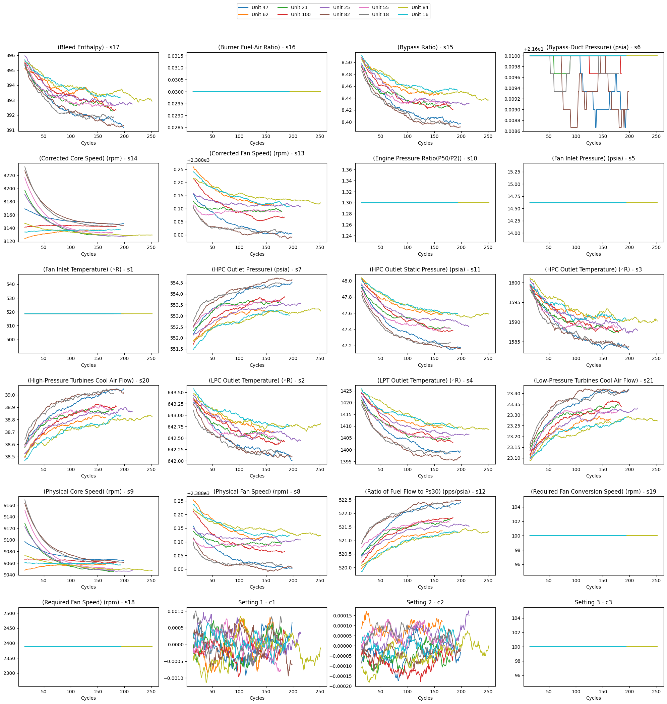
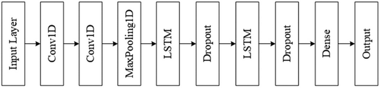
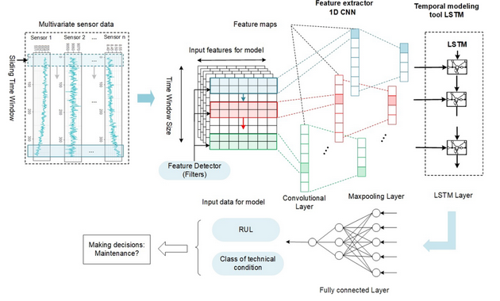
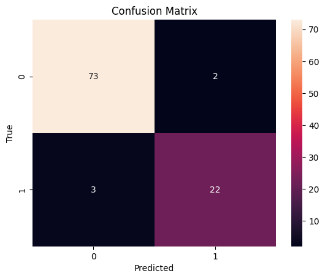
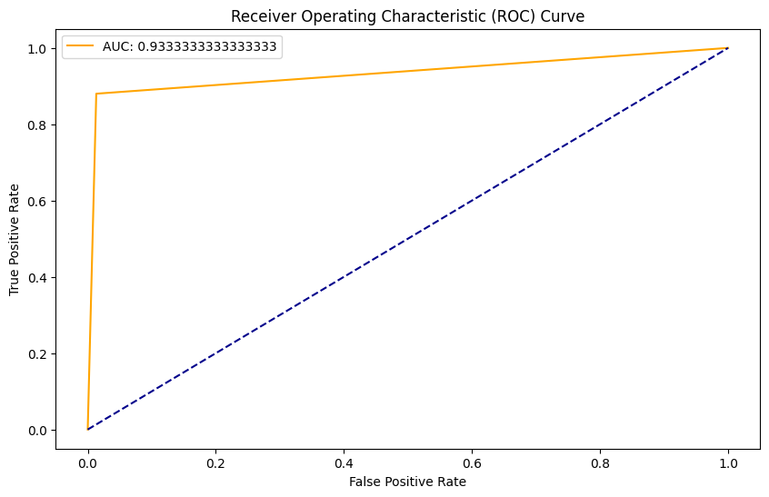
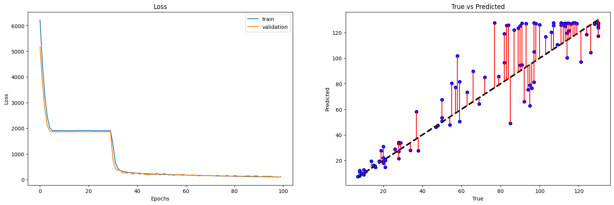

# NASA-s-C-MAPSS-RUL-Estimation

- [NASA-s-C-MAPSS-RUL-Estimation](#nasa-s-c-mapss-rul-estimation)
  - [Introduction](#introduction)
  - [Dataset](#dataset)
    - [FD001 Dataset](#fd001-dataset)
      - [Data Selection](#data-selection)
      - [Data Preprocessing](#data-preprocessing)
  - [Models](#models)
    - [Hybrid CNN-LSTM Model](#hybrid-cnn-lstm-model)
      - [Classification Results](#classification-results)
      - [Regression Results](#regression-results)
    - [CNN Model and LSTM Model](#cnn-model-and-lstm-model)
    - [Comparison](#comparison)
      - [Classification](#classification)
      - [Regression](#regression)
  - [Conclusion](#conclusion)
  - [Contributors](#contributors)

## Introduction

The goal of this challenge is to predict the remaining useful life of a machine based on the data collected from it. The data is collected from a machine in a factory. We will use multiple DL models such as CNN, LSTM and a hybrid model to predict the remaining useful life of the machine and then we compare the results. The code is based on [this paper](https://www.researchgate.net/publication/358360497_A_hybrid_deep_learning_framework_for_intelligent_predictive_maintenance_of_Cyber-Physical_Systems). We will do both classification (functional and non-functional) and regression for the remaining useful life.

## Dataset

The dataset is available at [this link](https://data.nasa.gov/Aerospace/CMAPSS-Jet-Engine-Simulated-Data/ff5v-kuh6/about_data). Data sets consists of multiple multivariate time series. Each data set is further divided into training and test subsets. Each time series is from a different engine i.e., the data can be considered to be from a fleet of engines of the same type. Each engine starts with different degrees of initial wear and manufacturing variation which is unknown to the user. This wear and variation is considered normal, i.e., it is not considered a fault condition. There are three operational settings that have a substantial effect on engine performance. These settings are also included in the data. The data is contaminated with sensor noise.

The engine is operating normally at the start of each time series, and develops a fault at some point during the series. In the training set, the fault grows in magnitude until system failure. In the test set, the time series ends some time prior to system failure. The objective of the competition is to predict the number of remaining operational cycles before failure in the test set, i.e., the number of operational cycles after the last cycle that the engine will continue to operate. Also provided a vector of true Remaining Useful Life (RUL) values for the test data.

### FD001 Dataset

FD001 subset corresponds to High-Pressure Compressor (HPC) failure of the engine.

The dataset FD001 contains time series of 21 sensors and 3 settings of 100 units(turbofan engine). Each engine works normally at the beginning of each time series and fails at the end of the time series. Each row is a snapshot of the data taken during a single operation cycle. The columns in the dataset are:

- (Fan Inlet Temperature) (◦R) - s1
- (LPC Outlet Temperature) (◦R) - s2
- (HPC Outlet Temperature) (◦R) - s3
- (LPT Outlet Temperature) (◦R) - s4
- (Fan Inlet Pressure) (psia) - s5
- (Bypass-Duct Pressure) (psia) - s6
- (HPC Outlet Pressure) (psia) - s7
- (Physical Fan Speed) (rpm) - s8
- (Physical Core Speed) (rpm) - s9
- (Engine Pressure Ratio(P50/P2)) - s10
- (HPC Outlet Static Pressure) (psia) - s11
- (Ratio of Fuel Flow to Ps30) (pps/psia) - s12
- (Corrected Fan Speed) (rpm) - s13
- (Corrected Core Speed) (rpm) - s14
- (Bypass Ratio) - s15
- (Burner Fuel-Air Ratio) - s16
- (Bleed Enthalpy) - s17
- (Required Fan Speed) (rpm) - s18
- (Required Fan Conversion Speed) (rpm) - s19
- (High-Pressure Turbines Cool Air Flow) - s20
- (Low-Pressure Turbines Cool Air Flow) - s21

Cycle analysis for this dataset gave us following plot:

From above plots it can be inferred that most of the engines work for about 200 cycles before failing. Now we have to add the `RUL` column to the dataset which will be the remaining useful life of the engine. The `RUL` column will be calculated as follows:

- For each engine, the last cycle will be the cycle at which the engine fails.
- The `RUL` for each cycle will be the difference between the last cycle and the current cycle.

As for test data, the `RUL` column will be calculated as follows:

- For each engine, the last cycle will be the cycle at which data ends.
- The `RUL` for each cycle will be the difference between the last cycle and the current cycle plus the `RUL` of the last cycle, which comes from the `RUL.txt` file.

#### Data Selection

For understanding which columns to select, we can plot the correlation matrix of the dataset. The correlation matrix will give us an idea of which columns are highly correlated with the `RUL` column, and which columns are not useful for the prediction. We also will check their changes with time to see if they are useful for the prediction.

Potential interrelationships within the system, grounded in the principles of physics and operational mechanics:

**Features Related to Temperature**:

- **Fan Inlet Temperature (°R)**: This is the air temperature as it enters the fan.
- **LPC Outlet Temperature (°R)**: This is the temperature after the air has passed through the Low-Pressure Compressor (LPC).
- **HPC Outlet Temperature (°R)**: This is the temperature after the air has passed through the High-Pressure Compressor (HPC).
- **LPT Outlet Temperature (°R)**: This is the temperature after the air has passed through the Low-Pressure Turbine (LPT).

Given the thermodynamic cycle of a jet engine, we can expect certain correlations among these temperature readings. For example, an increase in the fan inlet temperature could lead to corresponding increases in the temperatures post the compressors and turbines. However, factors such as the efficiency of the compressors and turbines could also influence these correlations. Notably, the HPC outlet temperature and LPT outlet temperature are often strongly correlated, particularly if the efficiency of the HPC directly impacts the LPT.

**Features Related to Pressure**:

- **Fan Inlet Pressure (psia)**: This is the air pressure at the point of entry into the fan.
- **Bypass-Duct Pressure (psia)**: This is the pressure within the bypass duct of a turbofan.
- **HPC Outlet Pressure (psia)**: This is the pressure after the air has passed through the High-Pressure Compressor.
- **HPC Outlet Static Pressure (psia)**: This is the static pressure after the air has passed through the High-Pressure Compressor.

Typically, the HPC outlet pressure and HPC outlet static pressure are measurements of pressure at the same location but from different perspectives (total vs static). The HPC outlet pressure generally refers to the total pressure (comprising both static and dynamic components), while the HPC outlet static pressure pertains only to the static component. The dynamic component is linked to the flow velocity. In situations where the velocity (and hence the dynamic pressure) doesn't vary significantly, the difference between these two pressures might be minimal. Therefore, one of these features could potentially be dropped after assessing their significance to the model.

**Features Related to Speed**:

- **Physical Fan Speed (rpm)**
- **Physical Core Speed (rpm)**
- **Corrected Fan Speed (rpm)**
- **Corrected Core Speed (rpm)**

The physical and corrected speeds for the same component (either the fan or the core) are likely to be correlated. The corrected speed is essentially the physical speed adjusted for ambient conditions. Depending on the specific use case, you might opt to use either the physical or corrected speed, but may not require both.

**Other Features**:
Features like the Engine Pressure Ratio (P50/P2), which represents a ratio of pressures, might also be correlated with individual pressure readings. This would need to be confirmed with data.

**Cool Air Flow Features**:

- **High-Pressure Turbines Cool Air Flow**
- **Low-Pressure Turbines Cool Air Flow**

Depending on the engine's design and operation, these could be correlated, especially if the cooling air flows are interconnected or influenced by similar operational conditions.

For further investigation, we plot the signals throughout the time series to see if they change significantly or not.

In above picture for being more clear, a time window is selected and we plot the mean values of all the signals in that window to be less prone to change.

#### Data Preprocessing

For better convergence we use an upper bound for the RUL. We can set the upper bound to 130 cycles. This means that if the RUL is greater than 130, we will set it to 130.

Then we should label them for classification, we can use the following labels:

- 0: The engine will fail within the next window cycles.
- 1: The engine will fail after the next window cycles.

And then we used `MinMaxScaler` to normalize the data. Finally, According to the article, we proceed to create several windows and use them for training and evaluating the model. The window length is denoted as NL, and the stride is denoted as k. Given that shorter strides can increase the number of training samples and potentially reduce the risk of overfitting, it makes sense to set k to 1. The data samples in a time window belong to the same engine unit. The target class and the Remaining Useful Life (RUL) of the last data point are used as the target label for each time window. The value of the parameter NL must be smaller than the length of the recorded data (the length of the recorded trajectories). Moreover, the larger the value of NL, the more capability the models will have to look back at the historical data. However, this will lead to increased training time. Therefore, for each test set in the case study, it is preferable that the values of NL are sufficiently large to take advantage of the historical information, but they should be smaller than the minimum length of the recorded trajectories. Given that the minimum recorded length in the C-MAPSS FD001 dataset is 31 cycles, the value of NL is set to 30 cycles.

## Models

We will use three different models to predict the remaining useful life of the machine, and then we will compare the results.

### Hybrid CNN-LSTM Model

The architecture of the hybrid CNN-LSTM  model is shown below:

This approach works by first using a CNN to extract features and then passing them to an LSTM network, which makes decisions based on the historical data. These two networks complement each other; when only one of them is used (as implemented later), we observe that although they have good accuracy, using both together to compensate for each other's shortcomings results in a more accurate model. The architecture and functionality of this model can be seen more precisely in the figure below:

#### Classification Results

(different approaches such as last window or all windows can be used and are available in the code, but here we just show the last window approach)

|              | precision | recall | f1-score | support |
|--------------|-----------|--------|----------|---------|
| 0.0          | 0.96      | 0.99   | 0.97     | 75      |
| 1.0          | 0.96      | 0.88   | 0.92     | 25      |
| **accuracy** |           |        | 0.96     | 100     |
| **macro avg**| 0.96      | 0.93   | 0.95     | 100     |
| **weighted avg** | 0.96  | 0.96   | 0.96     | 100     |

#### Regression Results

### CNN Model and LSTM Model

These two models are also implemented in the code, and their results are available there as well. We wont be showing specific results for each of them here.

### Comparison

#### Classification

| Model                         | Confusion Matrix    | Precision                       | Recall                       | AUC      |
|-------------------------------|---------------------|---------------------------------|------------------------------|----------|
| CNN Regression Model          | [[75, 0], [10, 15]] | [0.25, 1.0, 1.0]                | [1.0, 0.6, 0.0]              | 0.800000 |
| LSTM Regression Model         | [[74, 1], [3, 22]]  | [0.25, 0.9565217391304348, 1.0] | [1.0, 0.88, 0.0]             | 0.933333 |
| Hybrid CNN LSTM Regression Model | [[73, 2], [2, 23]]  | [0.25, 0.92, 1.0]                | [1.0, 0.92, 0.0]             | 0.946667 |

#### Regression

| Model                         | MSE         | MAE        | RMSE       | MAPE     |
|-------------------------------|-------------|------------|------------|----------|
| CNN Regression Model          | 287.801946  | 14.112710  | 16.964727  | 0.307122 |
| LSTM Regression Model         | 271.761140  | 11.638843  | 16.485179  | 0.169026 |
| Hybrid CNN LSTM Regression Model | 201.009866  | 10.639925  | 14.177795  | 0.154678 |

## Conclusion

As observed, the LSTM and CNN models also have acceptable accuracy, but the proposed model performs better in all aspects. This method of combining CNN and LSTM can also be used in other applications, and the results seem to be very promising.

## Contributors

- [Matin Bazrafshan](https://github.com/FabulousMatin)
- [Shahriar Attar](https://github.com/Shahriar-0)
